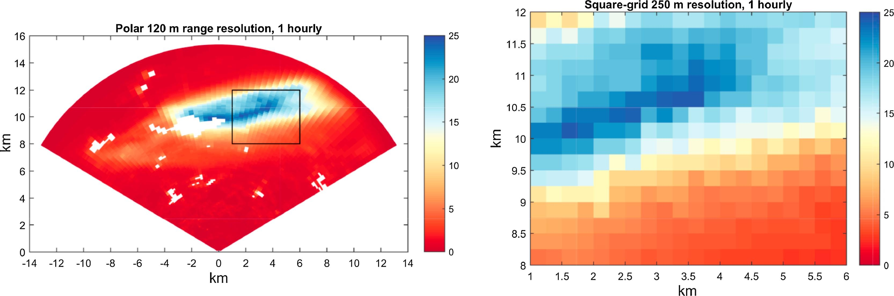
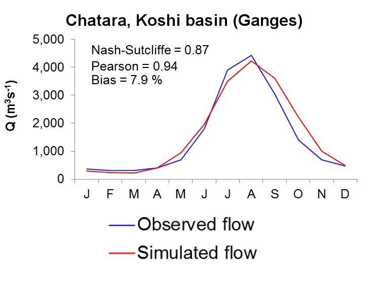
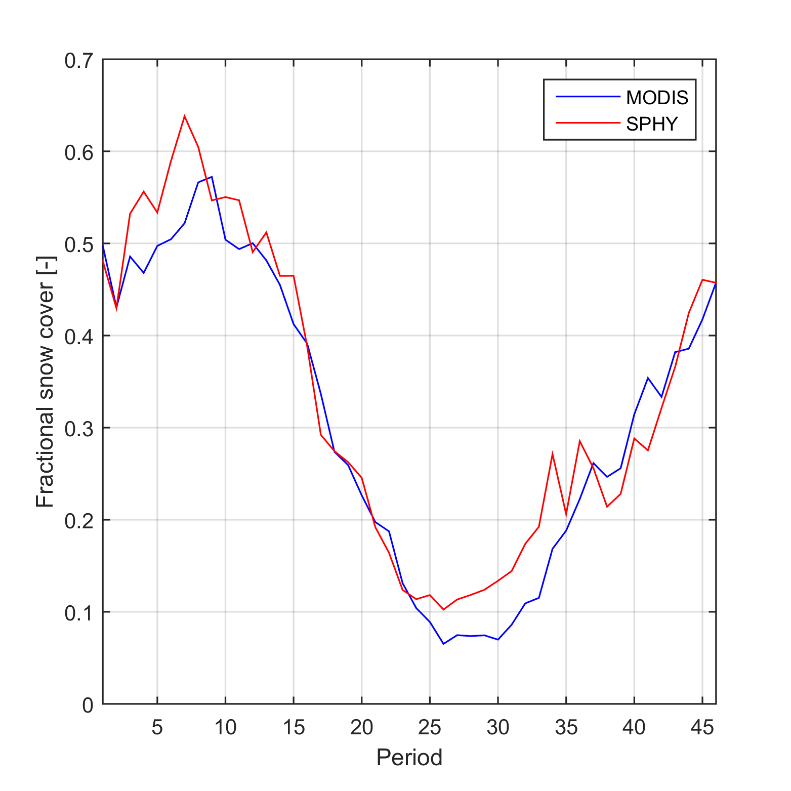
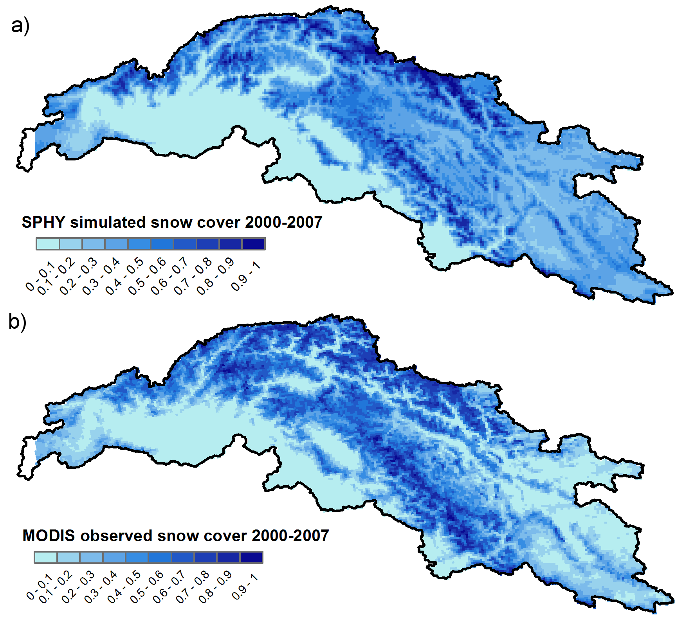

..  _applications:

============
Applications
============

This section describes a couple of applications in which the SPHY model has been applied. For each application it is
indicated which **model release** has been used.

Spatial resolutions in areal rainfall estimation and their impact on hydrological simulations of a lowland catchment
--------------------------------------------------------------------------------------------------------------------

Abstract
^^^^^^^^

Many studies suggest that high-density rain gauge networks are required to capture the rainfall heterogeneities necessary to
accurately describe the components of the hydrological cycle. However, equipping and maintaining a high-density rain gauge network
will also involve high costs. Although many studies provided useful insights on the required accuracy of rainfall estimates to accurately
describe the components of the hydrological cycle, most of these studies focused on streamflow simulations, large river basins or urban
environments.

The objective of this study was therefore to evaluate the impact of uncertainties in areal rainfall, estimated at several
spatial resolutions, on hydrological simulations of a small 6.5 km\ :sup:`2` rural lowland catchment. For this study, the SPHY model was forced with 
rainfall retrieved from an X-band radar (:numref:`fig_radar_image_JOH`) and various synthetic rainfall products, calculated using bootstrap samples of a varying number of
radar pixels, treated as virtual rain gauge locations within the catchment. This allowed us to determine the most appropriate resolution
of rainfall data to accurately describe the hydrology of a small rural lowland catchment.

.. _fig_radar_image_JOH:

   
   left: Example of an aggregated hourly X-band radar image with rain intensity in mm h\ :sup:`−1` and range resolution of 120 m. Right: Example of an aggregated hourly X-band radar image with rain intensity in mm h\ :sup:`−1` at a 250 m resolution square grid.

We found that the use of one rain gauge to estimate the catchment’s areal rainfall may lead to a potential error of more than six times the average
hourly rainfall. This may lead to uncertainties in simulated discharge that approach 60% of the average hourly discharge. More than 40 rain gauges
are required to reduce the potential error in areal rainfall estimation to values <0.1 mm h\ :sup:`−1`. The associated uncertainty in discharge simulations
is 20% if 10 rain gauges are used, and 10% if 40 rain gauges are used. The simulation of soil moisture contents and evapotranspiration rates are
hardly affected by the number of rain gauges used to estimate the areal rainfall, which is due to the high saturated hydraulic conductivities of
the top-soil. At least 12 gauges per km\ :sup:`2` are required to capture the spatial rainfall variation that is present in radar rainfall estimates.
Analysis of an individual 18-h rainfall event revealed that the uncertainty in peak areal rainfall estimated using one rain gauge may range between
−100% and 600%. The associated uncertainty in simulated discharge for this event ranges between −67 and 233%. With 25 rain gauges the uncertainty
in simulated discharge is still in the range of −17 to 33%.

.. _fig_SPHY_hourly_calibartion_JOH:

.. figure:: images/applications/SPHY_hourly_calibartion_JOH.jpg
   :figwidth: 100%
   
   Left: observed (Q\ :sub:`obs`) and SPHY simulated discharge (Q\ :sub:`sim`) for the calibration period 2001–2009. Right: idem, but for the hydrological year May 2001–April 2002.

Highlights
^^^^^^^^^^

+ Rain gauge sampling uncertainties impact hydrologic model output in small catchments.
  
+ High-resolution radar data can be used to simulate rain gauge sampling uncertainties.

+ A single rain gauge in a 6.5-km\ :sup:`2` area may sample 6 times the average hourly rainfall.

+ Discharge uncertainties are 60%, 20%, and 10% for 1, 10, and 40 gauges, respectively.

+ Uncertainties increase for larger rainfall intensities.

Version and reference
^^^^^^^^^^^^^^^^^^^^^
This application was done using an unreleased version of SPHY, for which the SPHY model code was modified to allow for
hourly model simulations.

A link to the peer-reviewed article :cite:`Terink2018b` of this application can be found below:

+ `Wilco Terink, Hidde Leijnse, Gé van den Eertwegh, and Remko Uijlenhoet. Spatial resolutions in areal rainfall estimation
  and their impact on hydrological simulations of a lowland catchment. Journal of Hydrology, 563:319–335, aug 2018.
  URL: https://www.sciencedirect.com/science/article/pii/S002216941830372X, doi:10.1016/J.JHYDROL.2018.05.045 <https://www.sciencedirect.com/science/article/pii/S002216941830372X>`_
  
The pdf to this application can be found `here <https://reader.elsevier.com/reader/sd/pii/S002216941830372X?token=51161C0436773ECDCF4E260C36BD92DE22034B8A31EA9995075770BC8FE17112C4D5AB0A0F0A82EA5303923701605903>`_.

Irrigation management in lowland areas
--------------------------------------

Introduction
^^^^^^^^^^^^

As SPHY produces spatial outputs for the soil moisture content in the root zone and the
potential and actual evapotranspiration (ET), it is a useful tool for application in agricultural
water management decision support. By facilitating easy integration of remote sensing data,
crop growth stages can be spatially assessed at different moments in time. The SPHY dynamic
vegetation module ensures that all relevant soil water fluxes correspond to crop development
stages throughout the growing season. Spatially distributed maps of root water content and ET
deficit can be produced, enabling both the identification of locations where irrigation is required
and a quantitative assessment of crop water stress. SPHY has been applied with the purpose of 
providing field-specific irrigation advice for a largescale farm in western Romania, comprising
380 individual fields and approximately ten different crops.

Methodology
^^^^^^^^^^^
A high spatial resolution is very relevant for supporting decisions on variable-rate irrigation. The model has therefore been
set up using a 30 m resolution, covering the 2013 and 2014 cropping seasons on a daily time-step. Optical
satellite data from Landsat 8 :cite:`USGS2013` were used as input to the dynamic vegetation module. Soil properties
were derived from the Harmonized World Soil Database :cite:`Batjes2012`, which for Romania contains data
from the Soil Geographical Database for Europe :cite:`Lambert2003`. Using the Van Genuchten equation :cite:`VanGenuchten1980`,
soil saturated water content, field capacity, and wilting point were determined for the
HWSD classes occurring at the study site. Elevation data was obtained from the EU-DEM data set :cite:`EEA2014`, and
air temperature was measured by two on-farm weather stations.

For calibration purposes, field measurements of soil moisture and/or actual ET are desired. In
this case study, one capacitance soil moisture sensor was installed in a soybean field to monitor
root-zone water content shortly after 1 May 2014, which is the start of the soybean growing
season. The sensor measures volumetric moisture content for every 10 cm of the soil profile up
to a depth of 60 cm. It is also equipped with a rain gauge measuring the sum of rainfall and
applied irrigation water, which was used as an input to SPHY. Soil moisture measured over the
extent covered by the crop root depth was averaged and compared to simulated values.

Results
^^^^^^^
In irrigation management applications like these, a model should be capable of simulating the
moisture stress experienced by the crop due to insufficient soil moisture contents, which
manifests itself by an evapotranspiration deficit (potential ET−actual ET>0). :numref:`fig_Romania_ET_deficit` shows the
spatial distribution of ET deficit, as simulated by the SPHY model for the entire farm on
3 April 2014. When SPHY is run in an operational setting, this spatial information can be
included in a decision support system that aids the farmer in irrigation planning for the coming
days.

.. _fig_Romania_ET_deficit:

.. figure:: images/applications/etdef_300dpi.png
   :figwidth: 60%
   
   Spatial distribution of evapotranspiration (ET) deficit, as simulated by the SPHY
   model for a Romanian farm on 3 April 2014. Transparency means no ET deficit.

Since this study was a demonstration project, only an initial model calibration was performed.
The model was in this case most sensitive for the crop coefficient (Kc), affecting the evaporative
demand for water. As can be seen in :numref:`fig_Romania_soil_moisture_calibration`, the temporal patterns as measured by the soil
moisture sensor are well simulated by the SPHY model. Based on daily soil moisture values, a
Nash–Sutcliffe :cite:`Nash1970` model efficiency coefficient of 0.6 was found,
indicating that the quality of prediction of the SPHY model is “good” :cite:`Foglia2009`.

.. _fig_Romania_soil_moisture_calibration:

.. figure:: images/applications/Romania_soil_moisture.png
   :figwidth: 70%
   
   Measured and simulated daily root-zone soil moisture content during the 2014
   growing season. Rainfall + irrigation has been measured by the rain gauge that was
   attached to the moisture sensor.

Soil moisture simulations could be further improved by conducting a full model calibration, adjusting
the soil physical parameters. Remotely sensed sensed evapotranspiration can be used in the 
calibration process :cite:`Immerzeel2008`, although such data are often not available on 
these small scales as ET is a very complex variable to assess :cite:`Samain2012`. It should also
be noted that soil moisture content is typically highly variable in space; a very high correlation
between point measurements and gridcell simulations of soil moisture may therefore not always be
feasible :cite:`Bramer2013`.

Version
^^^^^^^

This study was carried out using SPHY model release :ref:`2.0.0 <release_2.0.0>`.
 
Snow-fed and glacier-fed river basins
-------------------------------------

Introduction
^^^^^^^^^^^^

SPHY is being used in large Asian river basins with significant contribution of glacier melt and
snowmelt to the total flow (:cite:`Immerzeel2012a`, :cite:`Lutz2012a`, :cite:`Lutz2014`). The major goals of
these applications are two-fold:
 
+ Assess the current hydrological regimes at high resolution; e.g., assess spatial
  differences in the contributions of glacier melt, snowmelt and rainfall–runoff to the total
  flow.
   
+ Quantify the effects of climate change on the hydrological regimes in the future and how
  these affect the water availability.
  
Rivers originating in the high mountains of Asia are considered to be the most meltwater
dependent river systems on Earth :cite:`Schaner2012a`. In the regions surrounding
the Himalayas and the Tibetan Plateau large human populations depend on the water
supplied by these rivers :cite:`Immerzeel_2010a`. However, the dependency on melt water
differs strongly between river basins as a result of differences in climate and differences
in basin hypsometry :cite:`Immerzeel2012`. Only by using a distributed
hydrological modelling approach that includes the simulation of key hydrological and
cryospheric processes, and inclusion of transient changes in climate, snow cover,
glaciers and runoff, appropriate adaptation and mitigation options can be developed for
this region :cite:`Sorg2012`. The SPHY model is very suitable for such goals, and has
therefore been widely applied in the region.

Methodology
^^^^^^^^^^^

In the Himalayan Climate Change Adaptation Programme (HICAP), led by the International Centre
for Integrated Mountain Development (ICIMOD), SPHY has been successfully applied in the upstreambasins of the Indus, Ganges, Brahmaputra, Salween
and Mekong rivers (:cite:`Lutz2013`, :cite:`Lutz2014`).

For application in this region, SPHY was setup at a 1 km spatial resolution using a daily
time-step, and forced with historical air temperature (Tavg, Tmax, Tmin) and precipitation
data, obtained from global and regional datasets (e.g. APHRODITE :cite:`Yatagai2012a`,
Princeton :cite:`Sheffield2006a`, TRMM :cite:`Gopalan2010`) or interpolated WMO
station data froma historical reference period. For this historical reference period SPHY
was calibrated andvalidated using observed streamflow. For the future period, SPHY was
forced with downscaled climate change projections obtained from General Circulation
Models (GCMs), as available through the Climate Model Intercomparison Projects (e.g.
CMIP3 :cite:`Meehl2007a`, CMIP5 :cite:`Taylor2012`), which were used as basis for the
Assessment Reports prepared by the Intergovernmental Panel on Climate Change (IPCC).

Results
^^^^^^^

In this study the hydrological regimes of these five basins have been quantified and the
calibrated and validated model (:numref:`fig_HICAP_hydrographs`) was forced with an ensemble
of eight GCMs to create water availability scenarios until 2050.

.. _fig_HICAP_hydrographs:

   
   Average monthly observed and SPHY-simulated flow (1998-2007) for the Chatara major discharge measurement location
   in the Ganges basin :cite:`Lutz2014`. Metrics are calculated based on monthly time steps. 

:numref:`table_station_calibration_hicap`
lists the calibration and validation results. Based on the validation
results, we concluded that the model performs satisfactory given the large scale,
complexity and heterogeneity of the modeled region and data scarcity :cite:`Lutz2014`.
We used one parameter set for the entire domain, which inherently means
some stations perform better than others. In the particular case of the upper Indus,
another possible explanation could be uncertainty in air temperature forcing in the
highest parts of the upper Indus basin (locations Dainyor bridge, Besham Qila and
Tarbela inflow in :numref:`table_station_calibration_hicap`), since especially in this area, the used forcing datasets are
based on very sparse observations.
   
.. _table_station_calibration_hicap:

.. table:: Station locations used for calibration and validation of the SPHY model in HICAP :cite:`Lutz2014`.Three stations were used for calibration for 1998-2007. Five stations were used for an independent validation for the sameperiod. The Nash-Sutcliffe efficiency (NS) and bias metrics were calculated at a monthly time step.
   
   ==============    =======  =========   ======================
   Location          NS [-]   Bias [%]    Validation/Calibration
   ==============    =======  =========   ======================
   Dainyor bridge    0.39     58.2        validation
   Besham Qila       0.66     24.7        validation
   Tarbela Inflow    0.63     34.6        calibration
   Marala Inflow     0.65     12.0        validation
   Pachuwarghat      0.90     -1.6        validation
   Rabuwa Bazar      0.65     -22.5       validation
   Turkeghat         0.87     -5.4        calibration
   Chatara           0.87     7.9         calibration
   ==============    =======  =========   ======================

SPHY allowed the assessment of current contribution
of glacier melt and snow melt to total flow (:numref:`fig_contributions_ref_hicap`), and how total flow volumes
and the intra-annual distribution of river flow will change in the future :cite:`Lutz2014`.

.. _fig_contributions_ref_hicap:

.. figure:: images/applications/fig_contributions_ref_hicap.png
   :figwidth: 45%
   :align: right
   
   The contribution of glacier melt (a), snowmelt (b), and rainfall (c) to the total flow for major streams in the upstream basins of the Indus, Ganges, Brahmaputra, Salween and Mekong during 1998-2007 :cite:`Lutz2014`.

.. _calibration_MODIS_snow_cover:

Calibration on MODIS snow cover 
^^^^^^^^^^^^^^^^^^^^^^^^^^^^^^^^   

For basins with snow melt being an important contributor to the flow, besides calibration
to observed flow, the snow-related parameters in the SPHY model can also be calibrated
to observed snow cover. For the Upper Indus basin the snow-related parameters
degree-day factor for snow (DDF) and snow water storage capacity (SSC) were calibrated
independently using MODIS snow cover imagery :cite:`Lutz2014b`. The same
MODIS dataset was used as in :cite:`Immerzeel2009`. From the beginning of 2000 until
halfway 2008, the snow cover imagery was averaged for 46 different periods of 8 days (5
days for the last period) to generate 46 different average snow cover maps. E.g. period 1
is the average snowcover for 1-8 January for 2000 until 2008, whereas period 2 is the average
snow cover for 9-16 January for 2000 until 2008, etc.

.. _fig_MODIS_snow_cover_graph:

   
   Observed and simulated average fractional snow cover in the upper Indus basin. The values represent the 9-year average for 46 (8-day) periods during 2000-2007.

The SPHY model was run for 2000-2007 at a daily time step and for each 1 x 1 km grid cell the average snow cover was
calculated for the same 46 periods as in the MODIS observed snow cover dataset. Subsequently,
these simulated snowcover maps were resampled to 0.05 degrees spatial resolution, which is the
native resolution of the MODIS product.

:numref:`fig_MODIS_snow_cover_graph` shows the basin-average observed and simulated
fractional snow cover for the 46 periods during 2000-2007 and :numref:`fig_MODIS_snow_cover` shows the same at the 0.05
grid cell level. As a final step, the baseflow recession coefficient and routing coefficient (kx)
were calibrated to match the simulated streamflow with the observed streamflow.

.. _fig_MODIS_snow_cover:

   
   Observed and simulated average fractional snow cover in the upper Indus basin. The values represent the 9-year average for 46 (8-day) periods during 2000-2007.

Version
^^^^^^^

This study was carried out using SPHY model release :ref:`2.0.0 <release_2.0.0>`.

