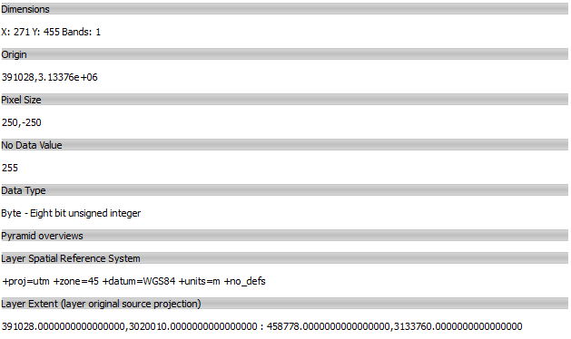
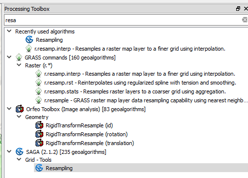
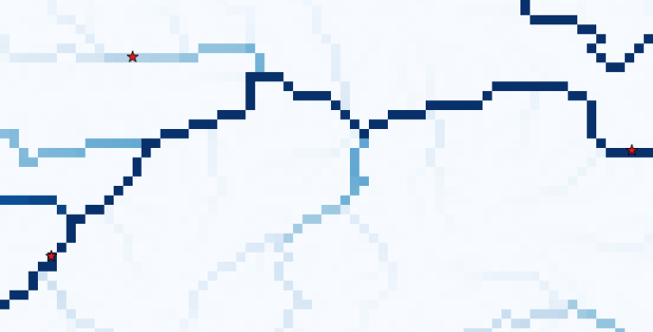
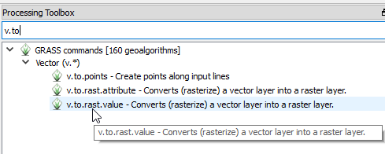
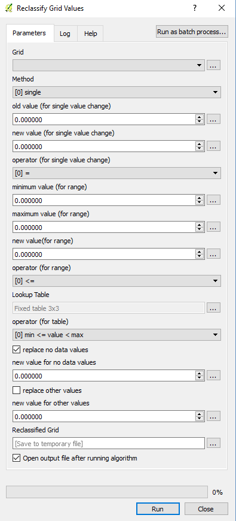

.. _building_model:

================
Building a model
================

.. note::
   The SPHY model makes extensive use of the PCRaster functionalities. Many of the SPHY model input maps
   can therefore be created using command line based PCRaster commands. An overview of PCRaster
   functions can be found `here <http://pcraster.geo.uu.nl/pcraster/4.2.1/documentation/pcraster_manual/sphinx/index.html#functional-list-of-applications-and-operations>`_.

This page describes the steps that are required to create SPHY model input. There is no unique approach in
creating SPHY model input, so the steps described in this section are just an example of how this can
be done using QGIS.

.. _clone:

Clone
-----

The first and most important step in creating your model input is setting the Coordinate Reference System (CRS), the model extent, and the spatial resolution
for the **clone** map. This is a map with ``TRUE`` for all cells that
are part of your model domain, and ``FALSE`` for the cells not being part of your model domain.

.. note::

   It is important to note that all the model input maps should have exactly the same CRS, extent (xmin, ymin, xmax, ymax), and
   spatial resolution (number of rows and columns) as the :ref:`clone <creating_clone>` map. 
 

Coordinate Reference System (CRS)
^^^^^^^^^^^^^^^^^^^^^^^^^^^^^^^^^

Calculations in SPHY are metric, which means you need to make sure that all your model data is in a metric coordinate system.
:numref:`fig_utm_zones` shows the Universal Transverse Mercator (UTM) zones. You may use this image to pick the UTM zone for
your area of interest. The link below provides a complete overview of the available Coordinate Reference Systems (CRSs):

    + http://spatialreference.org/ref/epsg/

.. _fig_utm_zones:

.. figure:: images/build_your_model/utm_zones.jpg
   :alt: UTM zones
   :figwidth: 90% 
   
   UTM zones.

If we for example would like to build a model for an area in the east of Nepal, we would select UTM zone 45N, which is the WGS84 UTM
Zone 45 North projection (EPSG:32645) in QGIS. 

Extent
^^^^^^

The next step is to define the corners (xmin and ymax) for your area of interest. The easiest way to do this is to add
a raster (e.g. a DEM) of your area of interest to QGIS. You need to make sure that this layer is in the same CRS
as defined in the previous paragraph (e.g. EPSG:32645). If that is not the case, then you need to re-project (`QGIS warp <https://docs.qgis.org/2.8/en/docs/user_manual/processing_algs/gdalogr/gdal_projections/warpreproject.html>`_)
the layer to match the defined CRS.

Right-click on the added layer and select properties and finally metadata. An example of how this may look like is shown in :numref:`fig_map_metadata`.

 
.. _fig_map_metadata:

   
   QGIS metadata. 

The example of :numref:`fig_map_metadata` represents a raster with 271 columns (X) and 455 rows (Y). The four values at the bottom represent
the layer extent in the order: ``xmin, ymin : xmax, ymax``. It is not a problem if the added map is slightly larger than your area of interest.
However, you need to make sure that the area for which you want to set-up your model fits well within the extent of the added layer. Note that
we can also see that the layer is in the correct CRS: the line below "Layer Spatial Reference System" shows that the layer is in the WGS84 UTM Zone 45.

Let's refer to this layer as the **source** layer.

Spatial resolution
^^^^^^^^^^^^^^^^^^

Now we are going to define the spatial resolution for our model. The choice of resolution will be a trade-off between the resolution of your input data,
computational resources, the number of runs you intend to do and the required detail for your modelling purpose.

Using the example from :numref:`fig_map_metadata` we can see that xmax and xmin are 485,778 and 391,028, respectively. The total horizontal distance is
therefore 485,778 - 391,028 = 94,750 m. The vertical distance is 3,133,760 - 3,020,010 = 113,750 m. If we would choose a spatial resolution of 250 m, then
the number of columns would be 379, and the number of rows 455. Let's decide we stay with the 250 m resolution. In that case we will have a model with
379 x 455 = 172,445 grid cells.

.. _creating_clone:

Creating the clone
^^^^^^^^^^^^^^^^^^

.. _source_already_in_resolution:

Source layer is already in the desired spatial resolution
"""""""""""""""""""""""""""""""""""""""""""""""""""""""""

Because the layer we have added to QGIS in the example above is already in the desired spatial resolution of 250 m (see "Pixel Size" in :numref:`fig_map_metadata`),
we can use this map as the base for our clone map. As mentioned before, the clone map is a boolean map with ``TRUE`` for all cells that
are part of your model domain, and ``FALSE`` for the cells not being part of your model domain.

It is not unlikely that the map you have added to QGIS is a
Digital Elevation Model (DEM) or other numerical map with floating numbers representing the value in each cell. Since the added map is not a boolean map, we need to convert this map from a float to
a boolean map. Before we can do this, we need to make sure that the map is in the PCRaster ``*.map`` format. If your added map is in GeoTIFF format, then we need to convert
the map from ``*.tif`` to ``*.map`` using `QGIS Translate <https://docs.qgis.org/2.8/en/docs/user_manual/processing_algs/gdalogr/gdal_conversion/translate.html>`_. 

Let's say we have translated a map with the name ``dem.tif`` to ``dem.map``. This can then easily be converted into a boolean clone map by::

    pcrcalc clone.map = boolean(dem.map)
    
    
Source layer is NOT in the desired spatial resolution
"""""""""""""""""""""""""""""""""""""""""""""""""""""    

If your added QGIS map is NOT in the desired resolution, then you first need to resample the map to the chosen spatial resolution. One way of doing this is using the `SAGA resampling <http://www.saga-gis.org/saga_tool_doc/2.3.0/grid_tools_0.html>`_
module from the QGIS Processing Toolbox (:numref:`fig_SAGA_resampling_tool`).

.. _fig_SAGA_resampling_tool:

   
   SAGA resample. 

Within the SAGA resample tool (:numref:`fig_SAGA_resample`) you need to select the "Grid" you like to resample (dem2 in this example), the "Output extent", and the "Cellsize" (250 m in this case). The fields
for the "Interpolation Method" and output "Grid" can be left unchanged. It is important that the output extent is set correctly, which can easily be achieved by choosing the option "Use layer/canvas extent".
Select the same layer that you specified under "Grid" (because it has the correct extent, but not the correct resolution). 

.. _fig_SAGA_resample:

.. figure:: images/build_your_model/SAGA_resample_to_extent_resolution.png
   :alt: SAGA resample
   :figwidth: 100% 
   
   Setting the grid cell size and use an existing layer to set the extent.

After clicking the "Run" button, a temporary grid is created and will be added to the QGIS canvas. This temporary grid can then be used as **source** layer, and the steps in the :ref:`previous paragraph <source_already_in_resolution>`
can be followed to create the **clone** map.

.. _creating_dem:

Digital Elevation Model (DEM)
-----------------------------

A DEM is a map with for each cell a floating number that represents the elevation in that cell. If your DEM is not in the same CRS as your clone, then you first need to re-project (`QGIS warp <https://docs.qgis.org/2.8/en/docs/user_manual/processing_algs/gdalogr/gdal_projections/warpreproject.html>`_)
the DEM to the CRS of the clone map. Check the metadata (same as :numref:`fig_map_metadata`) of your DEM map to see if the extent and spatial resolution are the same as the clone map. If that is not the case, then
you need to resample the DEM using the same approach as illustrated in :numref:`fig_SAGA_resampling_tool` and :numref:`fig_SAGA_resample`.

Once your DEM is in the same CRS, extent, and spatial resolution as your clone, you can convert the DEM to ``dem.map`` using `QGIS Translate <https://docs.qgis.org/2.8/en/docs/user_manual/processing_algs/gdalogr/gdal_conversion/translate.html>`_.

If you want the DEM to only have values where your clone is ``TRUE``, then you can achieve this by::

    pcrcalc dem_new.map = if(clone.map, dem.map)
    
Slope
-----

Once you have ``dem.map`` created, the ``slope.map`` can easily be created by::

    pcrcalc slope.map = slope(dem.map)
    
    
Local Drain Direction (ldd)
---------------------------

ldd
^^^

An ldd is a local drain direction map with flow directions from each cell to its steepest downslope neighbour.
To create a Local Drain Direction (ldd) map you need a :ref:`DEM <creating_dem>`. An ldd is then created using::

  pcrcalc ldd.map = lddcreate(dem.map, 1e31, 1e31, 1e31, 1e31)
  
The ``1e31`` (default) arguments can be substituted depending on the orography of your catchment. More details about these
arguments can be found `here <http://pcraster.geo.uu.nl/pcraster/4.2.1/documentation/pcraster_manual/sphinx/op_lddcreate.html?highlight=lddcreate>`_.
In most cases, the ``1e31`` value satisfies the creation of the ldd.

The ldd map in combination with the locations map can be used to create a :ref:`catchment or sub-catchment map <catchment_subcatchment>`.

.. _accuflux:

accuflux
^^^^^^^^

A test to verify if your ldd has been created correctly is to calculate for each cell the number of upstream cells. This can be achieved using the ``accuflux`` function::

  pcrcalc accuflux.map = accuflux(ldd.map, 1)
   
You can validate the ``accuflux.map`` by dragging it into QGIS and compare it with a shapefile of your river network (if you have this).

More details about the ``accuflux`` function can be found `here <http://pcraster.geo.uu.nl/pcraster/4.2.1/documentation/pcraster_manual/sphinx/op_accuflux.html?highlight=accuflux>`_. 

lddrepair
^^^^^^^^^

Each cell on the local drain direction map must have a pit (value of 5) at the end of its downstream path. If this is not the case for one or more cells on a local drain direction map,
the map is called unsound. An unsound local drain direction map can not be used as input expression for the operations with local drain direction maps. Sometimes the unsound ldd can be
fixed using ``lddrepair``::

   pcrcalc lddsound.map = lddrepair(ldd.map)

More details about ``lddrepair`` can be found `here <http://pcraster.geo.uu.nl/pcraster/4.2.1/documentation/pcraster_manual/sphinx/op_lddrepair.html?highlight=lddrepair>`_.

Locations
---------

The locations map is required for reporting time-series of the various model fluxes (e.g. routed streamflow). As is shown in :numref:`table_sphy_data_types`, the ``locations.map`` is a ``nominal`` map. The
easiest way to create a locations map is to have a point shapefile representing the various stations in your area of interest. For the locations map it is required to:

    1. Give the stations a unique ID starting with 1 and the ID of the last station being equal to the total number of stations: e.g. if you have 4 stations for your model, you have to number them 1, 2, 3,
       and 4.
       
    2. If you want to report routed fluxes, you need to make sure the stations are located on the delineated stream network. A good practice of doing this is to use :ref:`accuflux <accuflux>` map
       as a background layer to check if the position of your stations is correct (see :numref:`fig_stations_on_accuflux`). 

.. _fig_stations_on_accuflux:

   
   Adding stations using the accuflux.map as a background. The stations in the shapefile are represented by the red stars.

Once the stations are numbered correctly, and are in the correct location, you again need to make sure that the map is in the same CRS, extent, and spatial resolution as your clone.map. Finally you need
to make sure the map is saved as a nominal map. The steps are summarized under :ref:`"Other static input maps" <other_static_input_maps>`. 

.. _catchment_subcatchment:

Catchment and sub-catchment
---------------------------

The ``catchment.map`` and ``subcatchment.map`` can be created once the ``ldd.map`` and ``locations.map`` are created correctly. These two maps can be created using::

  pcrcalc catchment.map = catchment(ldd.map, locations.map)
  
and::

  pcrcalc subcatchment.map = subcatchment(ldd.map, locations.map)

Obviously, names of the input maps may be different if you have assigned different names in one of the preceeding steps.

.. _glacier_input:

Glaciers
--------

.. _glacier_input_2.2.0:

SPHY 2.2.0 and newer releases
^^^^^^^^^^^^^^^^^^^^^^^^^^^^^

SPHY 2.2.0 comes with an improved glacier module with glaciers being mass-conserving. With this module you can have a better representation of the glaciers using a higher resolution DEM than the DEM
you use to run your model. More information regarding this module can be found under :ref:`version 2.2.0 <release_2.2.0>`. 

To run the model with this improved glacier module, you need to create the following input:

  + GlacTable: a csv-file (:numref:`fig_glac_table_ice_depths`) with the header ``U_ID, MOD_ID, GLAC_ID, MOD_H, GLAC_H, DEBRIS, FRAC_GLAC, ICE_DEPTH``. The columns are described below:
      
      1. ``U_ID``: unique combination of model cell ID, glacier ID, glacier elevation, and debris/glacier free; i.e. each line in the csv-file should have a unique ``U_ID``.
      
      2. ``MOD_ID``: model cell ID a glacier cell belongs to. Different glaciers (multiple glacier IDs), or just one glacier but with different elevations (based on the higher
         resolution DEM) may occur within the same model cell ID, which means that in both cases that the model cell ID may occur on multiple lines in the csv-file.
      
      3. ``GLAC_ID``: glacier cells with the same glacier should have the same glacier ID.
      
      4. ``MOD_H``: DEM elevation of the model ID grid cell.
      
      5. ``GLAC_H``: DEM elevation of the glacier ID grid cell.
      
      6. ``DEBRIS``: Flag indicating whether the particular glacier grid cell has debris (``TRUE = 1``), or is debris-free (``FALSE = 0``).
      
      7. ``FRAC_GLAC``: Fraction of the model grid cell ID that is covered with glacier grid cell ID. The total fraction of all glacier grid cell IDs belonging to the same model grid cell ID may
         never exceed 1. 
      
      8. ``ICE_DEPTH``: Thickness of the glacier ID grid cell. 
      
  + ModelID: Nominal map with a unique ID for each model grid cell (same CRS, extent, and spatial resolution as the clone map).
  
  + GlacID: Nominal map with a unique ID for each glacier (same CRS, extent, and spatial resolution as the clone map).
  
An example of a few lines in the GlacTable is shown in :numref:`fig_glac_table_ice_depths`. As you can see there are four different glaciers shown here, each with their unique ``GLAC_ID``. Each line has a
unique ``U_ID`` as is required. You can see that the glacier with ``GLAC_ID`` equals 17 is the largest of the four, covering ten unique model grid cells (``MOD_ID``). What you also may notice is that
this glacier may occur twice within the same model ID grid cell (e.g. 62850). This is because part of the glacier in that model grid cell is debris-covered (with a glacier fraction of 0.92), and the
rest of that glacier in that model cell is debris-free (fraction 0.08). This table also illustrates that the sum of all glacier fractions within the same model grid cell never exceeds one (it can be less).
The elevation (``MOD_H``) for each model ID grid cell is unique for that particular model ID grid cell.    

.. _fig_glac_table_ice_depths:

.. figure:: images/build_your_model/glac_table_ice_depths.png
   :alt: Example of glacier table.
   :figwidth: 70% 
   
   Example of a few lines in the GlacTable csv-file. For easy reading the glaciers with the same ID are given the same background color.
  
To be able to construct the required maps and the glacier table csv-file you need:

  + A shapefile with the outlines of the glaciers within your area of interest. The `Randolph Glacier Inventory (RGI) <https://www.glims.org/RGI/>`_ is a recommended source for this.
  
  + A classification of which areas are debris-free and which are debris-covered.
  
  + A high-resolution DEM.
  

A methodology to estimate ice-thickness is using the **GlabTop2 model**, which is described in :cite:`Frey2014`.

Older releases
^^^^^^^^^^^^^^

For older SPHY model versions, you need to create the ``glacfrac.map``. This map can be calculated from a vector file with glacier outlines (e.g. the `RGI <https://www.glims.org/RGI/>`_). Follow the
steps below to convert the glacier outlines to the ``glacfrac.map``:

  1. In QGIS from the Processing toolbox, select the “v.to.rast.value” tool (:numref:`fig_v_to_rast_value`).
  
  2. Select your glacier outlines as vector input layer and convert it to raster at the same extent of
     the clone map. Set the cellsize at a lower value than your model resolution. For example, if your
     model cell size is 200 m, select 20 m for the converted raster. Set 1 as the raster value.
     
  3. The “nodata” values need to be reclassified to zeros. To do this use SAGA’s Reclassify tool (:numref:`fig_saga_reclassify_toolbox`)
     from the Processing toolbox.
     
  4. In the dialog box (:numref:`fig_saga_reclassify_grid_values`) set all values to 0.0, and set “replace no data values” to “Yes”, set “new value
     for no data values” to 0.0 and set “replace other values” to “No”. Select an output filename and
     click “Run”.
     
  5. Now we aggregate the fine resolution grid with glaciers to the model resolution. This can be done using the “r.resamp.stats” toolbox (:numref:`fig_GRASS_r_resamp_stats_toolbox`).
     In the dialog box, set the fine resolution glacier grid (result step 4) as input raster layer and choose aggregation method “average”. Use the extent from the clone map in the
     "Grass region cellsize" field, and set the cell size to the model resolution (clone).
     
  6. The last step involves converting the map from step 5 into a PCRaster map.

.. _fig_v_to_rast_value:

   
   v.to.rast.value toolbox in QGIS.

.. _fig_saga_reclassify_toolbox:

.. figure:: images/build_your_model/SAGA_reclassify.png
   :alt: SAGA reclassify toolbox
   :figwidth: 70% 
   
   SAGA reclassify toolbox.
   
   
.. _fig_saga_reclassify_grid_values:

   
   Reclassify "nodata" values to zero using the SAGA reclassify toolbox.   

.. _fig_GRASS_r_resamp_stats_toolbox:

.. figure:: images/build_your_model/GRASS_r_resamp_stats_toolbox.png
   :alt: GRASS resamp stats toolbox
   :figwidth: 70% 
   
   r.resamp.stats toolbox.

.. _other_static_input_maps:   
    
Other static input maps
-----------------------

Other static input maps (e.g. the soil maps and land use maps) can be created the same way as the DEM. The steps to create other static input maps are always the same:

  1. Make sure that the CRS of your map in QGIS is the same as the CRS of your :ref:`clone map <clone>`. If this is not the case, then you need to re-project (`QGIS warp <https://docs.qgis.org/2.8/en/docs/user_manual/processing_algs/gdalogr/gdal_projections/warpreproject.html>`_)
     the map to the CRS of the clone map.
  
  2. Check the metadata (same as :numref:`fig_map_metadata`) of your map to see if the extent and spatial resolution are the same as the clone map. If that is not the case, then
     you need to resample the map using the same approach as illustrated in :numref:`fig_SAGA_resampling_tool` and :numref:`fig_SAGA_resample`.
     
  3. If your map is not in the PCRaster ``*.map`` format, but for example in the ``*.tif`` format, then you have to convert it using `QGIS Translate <https://docs.qgis.org/2.8/en/docs/user_manual/processing_algs/gdalogr/gdal_conversion/translate.html>`_.
  
  4. Once your map is in the required PCRaster format, then the last step is to make sure the data type of the map matches the data type of the specific SPHY input map. For example, a DEM requires ``scalar`` data type, while a land use map
     should be ``nominal``. Data types can easily be converted using the cmd line. A scalar map ``A.map`` can for example easily be converted to a nominal ``B.map`` using::
     
       pcrcalc B.map = nominal(A.map)
      
     
     An overview of the various SPHY model data types is shown in :numref:`table_sphy_data_types`.
     
     
.. _table_sphy_data_types:

.. table:: Map data types used in the SPHY model.
   
   ==============    ===========================================      =====================================
   Data type         Domain                                           Example
   ==============    ===========================================      =====================================
   ``boolean``       ``TRUE`` :math:`[1]`, ``FALSE`` :math:`[0]`      ``clone.map``
   ``nominal``       :math:`[-2^{31}..2^{31}]` integers               ``landuse.map``, ``locations.map``
   ``scalar``        :math:`[-10^{37}..10^{37}]` floats               ``dem.map``, ``slope.map``, ``sub_field.map``, ``glacfrac.map``
   ``ldd``           :math:`[1..9]` integer of drain direction        ``ldd.map``   
   ==============    ===========================================      =====================================
   

   
 

    

